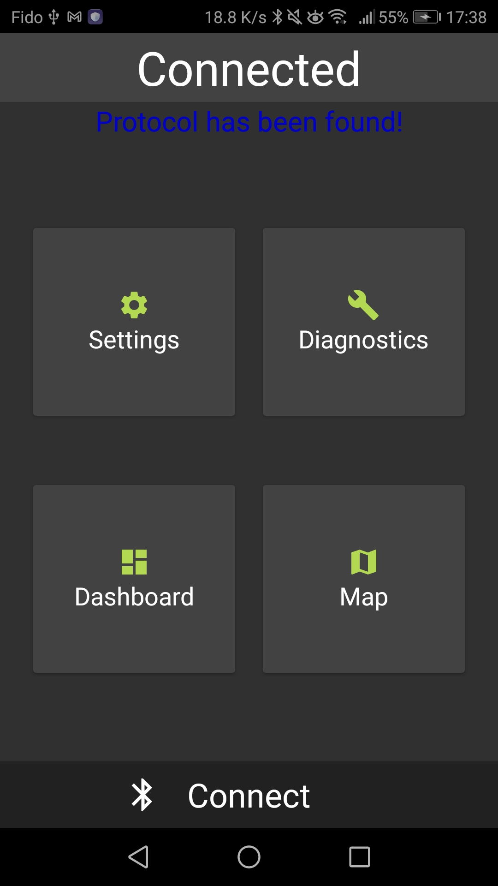
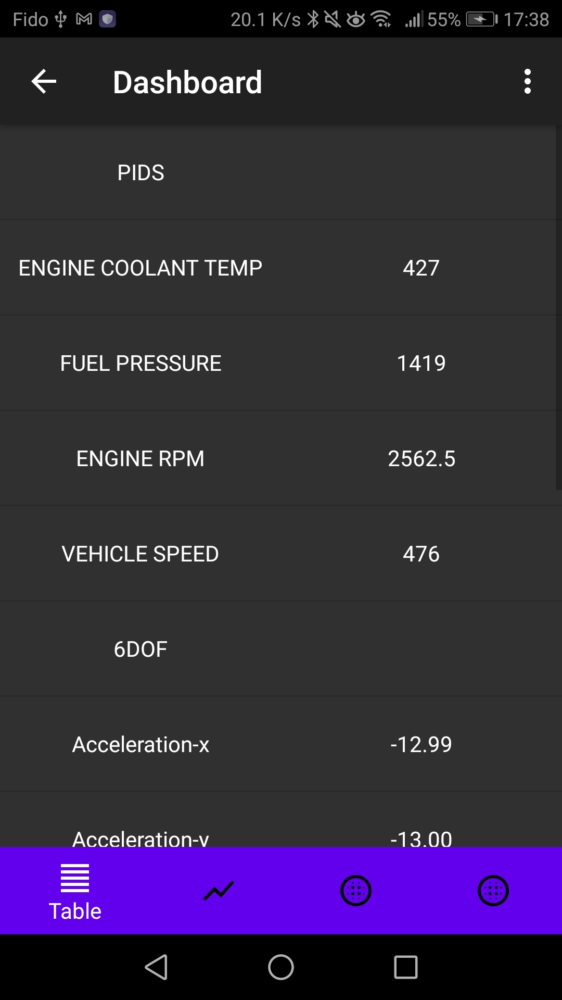
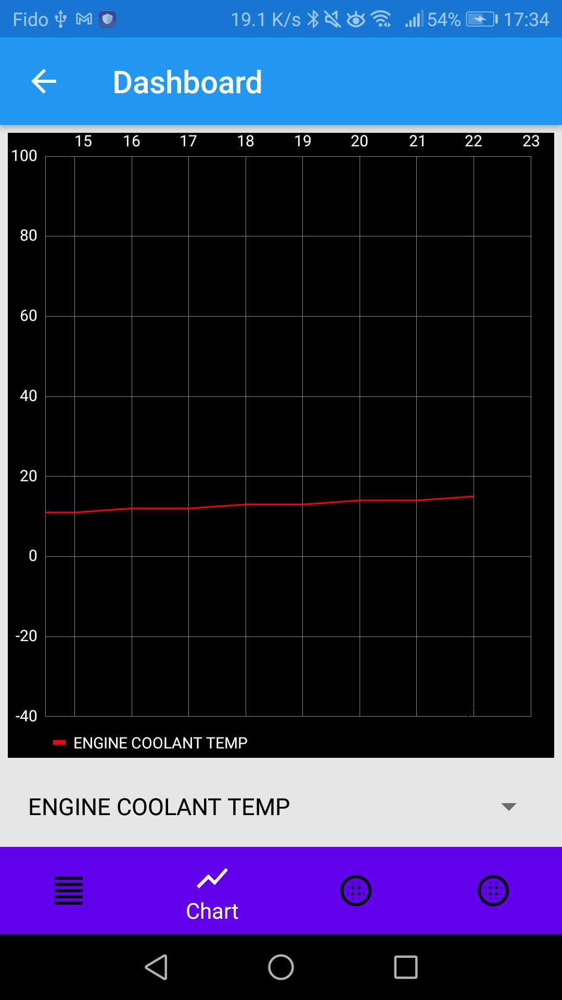
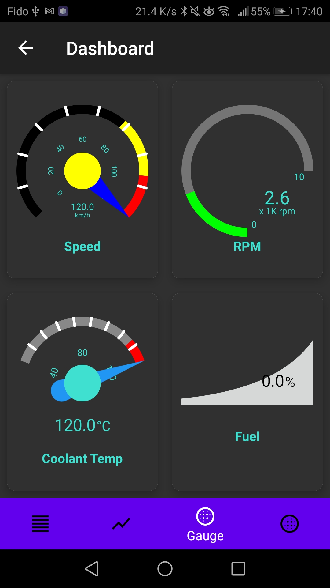
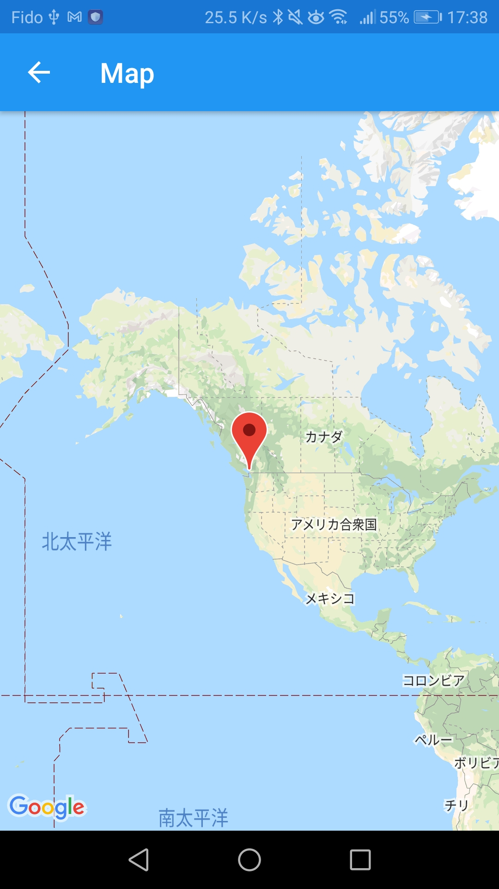

# CANnect

Automotive diagnostic application developed as part of 2020 Capstone Project.

## System Overview

## Hardware

## Mobile App

Developed with Java and XML.

  

    
    
    
  

  

    
    
    
  

## Contributors

- Choong Jin Ng
- Enes Yazici
- Ranjoat Chana
- Win Aung
- Nicholas Lau
- Takehiro Tanaka
